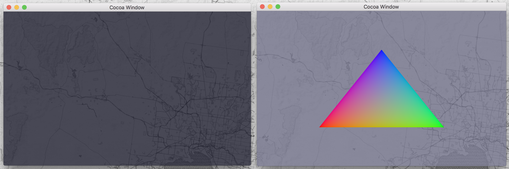

# Cocoa-OpenGLWindowing

### About:
The purpose of this project is to create a demo & library, which can be used for creating macos / osx OpenGL window's using the native Cocoa API. The primary goal for this project is for it to be usable in C++ projects.

### Dependencies:
As this project uses Apples API's it is macos / osx dependent. The libraries / frameworks it requires are:

 - Cocoa framework *(Wrapper including: AppKit.framework, Foundation.framework, CoreData.framework)*
 - OpenGL framework

All the above libraries / frameworks can be found on all modern macos / osx installs.

### Build Process:
This project includes multiple **bash build scripts** that when run will build the project into a usable static or dynamic library.
In addition this project includes a demo build script that will create an executable demo that showcases the project.
The Compiler user by the build scripts is *Clang*, in addition *libtool* is used for creating the dynamic and static libraries. All these can be found if *Xcode's Command Line Tools* are installed.

- **./build_static**, will generate a static library. *Dependencies* will require linking when using this form of the library.
- **./build_dynamic**,  will generate a dynamic library.
- **./build_demo**, will create an demo executable.
- Build products can be found inside the builds directory.

### Sublime Text:
There is a Sublime Text 3 project included inside **other/** for convenience. It can be used to build directly from inside the sublime editor.